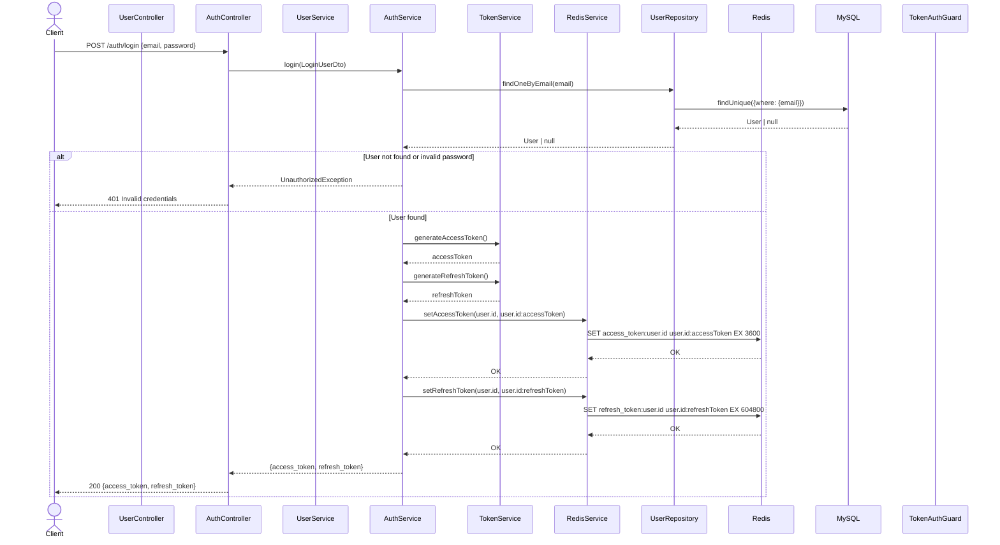

```mermaid
sequenceDiagram
  actor Client
  participant Controller as UserController
  participant AuthController
  participant UserService
  participant AuthService
  participant TokenService
  participant RedisService
  participant UserRepo as UserRepository
  participant Redis
  participant MySQL
  participant Guard as TokenAuthGuard


  %% Login Flow
  Client->>AuthController: POST /auth/login {email, password}
  AuthController->>AuthService: login(LoginUserDto)
  AuthService->>UserRepo: findOneByEmail(email)
  UserRepo->>MySQL: findUnique({where: {email}})
  MySQL-->>UserRepo: User | null
  UserRepo-->>AuthService: User | null
  alt User not found or invalid password
    AuthService-->>AuthController: UnauthorizedException
    AuthController-->>Client: 401 Invalid credentials
  else User found
    AuthService->>TokenService: generateAccessToken()
    TokenService-->>AuthService: accessToken
    AuthService->>TokenService: generateRefreshToken()
    TokenService-->>AuthService: refreshToken
    AuthService->>RedisService: setAccessToken(user.id, user.id:accessToken)
    RedisService->>Redis: SET access_token:user.id user.id:accessToken EX 3600
    Redis-->>RedisService: OK
    RedisService-->>AuthService: OK
    AuthService->>RedisService: setRefreshToken(user.id, user.id:refreshToken)
    RedisService->>Redis: SET refresh_token:user.id user.id:refreshToken EX 604800
    Redis-->>RedisService: OK
    RedisService-->>AuthService: OK
    AuthService-->>AuthController: {access_token, refresh_token}
    AuthController-->>Client: 200 {access_token, refresh_token}
  end

```