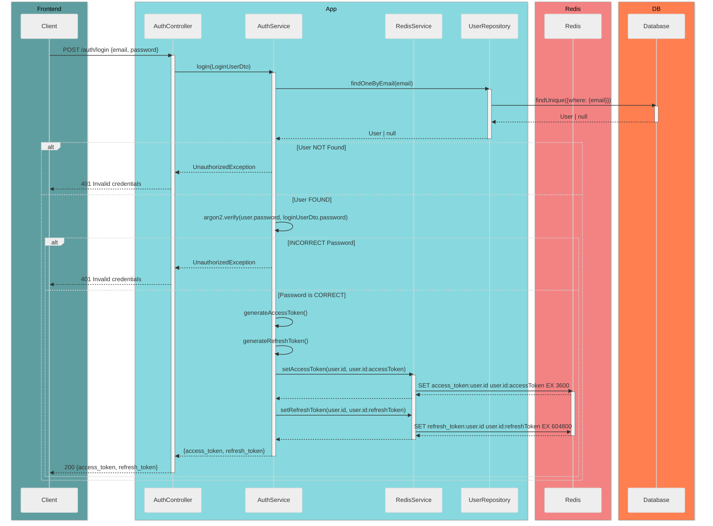

```mermaid
---
config:
  theme: 'neutral'
  themeVariables:
    primaryColor: '#4f96e7ff'
    primaryBorderColor: 'rgba(153, 188, 241, 1)'
    lineColor: '#F8B229'
    secondaryColor: '#006100'
    tertiaryColor: '#ffffff60'
---
sequenceDiagram
  box cadetblue Frontend
    participant Client
  end

  box rgba(135, 217, 223, 1) App
    participant AuthController
    participant AuthService
    participant RedisService
    participant UserRepo as UserRepository
  end

  box rgba(243, 131, 131, 1) Redis
    participant Redis
  end

  box coral DB
    participant DB as Database
  end

  %% Login Flow
  Client->>AuthController: POST /auth/login {email, password}
  activate AuthController
  AuthController->>AuthService: login(LoginUserDto)
  activate AuthService
  AuthService->>UserRepo: findOneByEmail(email)
  activate UserRepo
  UserRepo->>DB: findUnique({where: {email}})
  activate DB
  DB-->>UserRepo: User | null
  deactivate DB
  UserRepo-->>AuthService: User | null
  deactivate UserRepo
  alt User NOT Found
    AuthService-->>AuthController: UnauthorizedException
    AuthController-->>Client: 401 Invalid credentials
  else User FOUND
    AuthService ->> AuthService: argon2.verify(user.password, loginUserDto.password)
    alt INCORRECT Password
      AuthService-->>AuthController: UnauthorizedException
      AuthController-->>Client: 401 Invalid credentials
    else Password is CORRECT
      AuthService->>AuthService: generateAccessToken()
      AuthService->>AuthService: generateRefreshToken()

      AuthService->>RedisService: setAccessToken(user.id, user.id:accessToken)
      activate RedisService
      RedisService->>Redis: SET access_token:user.id user.id:accessToken EX 3600
      activate Redis
      Redis-->>RedisService:

      RedisService-->>AuthService:
      AuthService->>RedisService: setRefreshToken(user.id, user.id:refreshToken)
      RedisService->>Redis: SET refresh_token:user.id user.id:refreshToken EX 604800
      Redis-->>RedisService:
      deactivate Redis
      RedisService-->>AuthService:
      deactivate RedisService
      AuthService-->>AuthController: {access_token, refresh_token}
      deactivate AuthService
      AuthController-->>Client: 200 {access_token, refresh_token}
      deactivate AuthController
    end
  end

```
