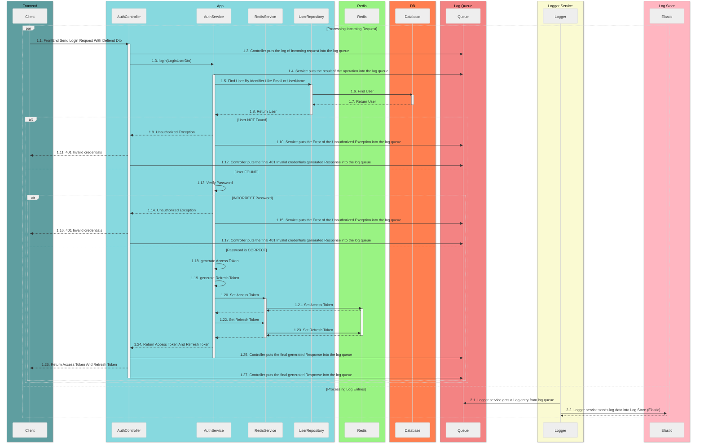

```mermaid
---
config:
  theme: 'neutral'
  themeVariables:
    primaryColor: '#4f96e7ff'
    primaryBorderColor: 'rgba(153, 188, 241, 1)'
    lineColor: '#F8B229'
    secondaryColor: '#006100'
    tertiaryColor: '#ffffff60'
---
sequenceDiagram
  box cadetblue Frontend
    participant Client
  end

  box rgba(135, 217, 223, 1) App
    participant AuthController
    participant AuthService
    participant RedisService
    participant UserRepo as UserRepository
  end

  box rgba(153, 243, 131, 1) Redis
    participant Redis
  end

  box coral DB
    participant DB as Database
  end

  box rgba(243,131,131,1) Log Queue
    participant Queue
  end

  box LightGoldenRodYellow Logger Service
    participant Logger
  end

  box LightPink Log Store
    participant Elastic
  end

par Processing Incoming Request
  %% Login Flow
  Client->>AuthController: 1.1. FrontEnd Send Login Request With Defiend Dto
  activate AuthController
  AuthController ->> Queue: 1.2. Controller puts the log of incoming request into the log queue
  AuthController->>AuthService: 1.3. login(LoginUserDto)
  AuthService ->> Queue: 1.4. Service puts the result of the operation into the log queue
  activate AuthService
  AuthService->>UserRepo: 1.5. Find User By Identifier Like Email or UserName
  activate UserRepo
  UserRepo->>DB: 1.6. Find User
  activate DB
  DB-->>UserRepo: 1.7. Return User
  deactivate DB
  UserRepo-->>AuthService: 1.8. Return User
  deactivate UserRepo
  alt User NOT Found
    AuthService-->>AuthController: 1.9. Unauthorized Exception
    AuthService ->> Queue: 1.10. Service puts the Error of the Unauthorized Exception into the log queue
    AuthController-->>Client: 1.11. 401 Invalid credentials
    AuthController ->> Queue: 1.12. Controller puts the final 401 Invalid credentials generated Response into the log queue
  else User FOUND
    AuthService ->> AuthService: 1.13. Verify Password
    alt INCORRECT Password
      AuthService-->>AuthController: 1.14. Unauthorized Exception
      AuthService ->> Queue: 1.15. Service puts the Error of the Unauthorized Exception into the log queue
      AuthController-->>Client: 1.16. 401 Invalid credentials
      AuthController ->> Queue: 1.17. Controller puts the final 401 Invalid credentials generated Response into the log queue
    else Password is CORRECT
      AuthService->>AuthService: 1.18. generate Access Token
      AuthService->>AuthService: 1.19. generate Refresh Token

      AuthService->>RedisService: 1.20. Set Access Token
      activate RedisService
      RedisService->>Redis: 1.21. Set Access Token
      activate Redis
      Redis-->>RedisService:

      RedisService-->>AuthService:
      AuthService->>RedisService: 1.22. Set Refresh Token
      RedisService->>Redis: 1.23. Set Refresh Token
      Redis-->>RedisService:
      deactivate Redis
      RedisService-->>AuthService:
      deactivate RedisService
      AuthService-->>AuthController: 1.24. Return Access Token And Refresh Token
      AuthController ->> Queue: 1.25. Controller puts the final generated Response into the log queue
      deactivate AuthService
      AuthController-->>Client: 1.26. Return Access Token And Refresh Token
      AuthController ->> Queue: 1.27. Controller puts the final generated Response into the log queue
      deactivate AuthController
    end
  end
  and Processing Log Entries
        Logger->>Queue: 2.1. Logger service gets a Log entry from log queue
        Logger ->> Elastic: 2.2. Logger service sends log data into Log Store (Elastic)
        Elastic -->> Logger:
end
```
