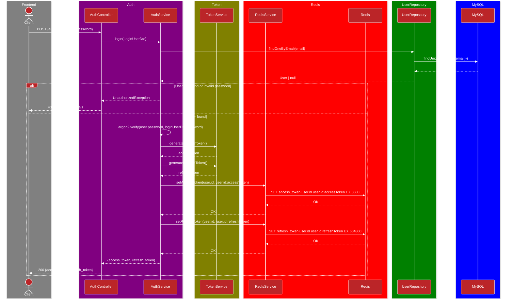

```mermaid
---
config:
  theme: 'base'
  themeVariables:
    primaryColor: '#BB2528'
    primaryTextColor: '#fff'
    primaryBorderColor: '#fff'
    lineColor: '#F8B229'
    secondaryColor: '#006100'
    tertiaryColor: '#fff'
---
sequenceDiagram
  box Gray Frontend
  actor Client
  end

  box Purple Auth
  participant AuthController
  participant AuthService
  end

  box Olive Token
  participant TokenService
  end

  box Red Redis
  participant RedisService
  participant Redis
  end

  box Green UserRepository
  participant UserRepo as UserRepository
  end

  box Blue MySQL
  participant MySQL
  end

  %% Login Flow
  Client->>AuthController: POST /auth/login {email, password}
  AuthController->>AuthService: login(LoginUserDto)
  AuthService->>UserRepo: findOneByEmail(email)
  UserRepo->>MySQL: findUnique({where: {email}})
  MySQL-->>UserRepo: User | null
  UserRepo-->>AuthService: User | null
  alt User not found or invalid password
    AuthService-->>AuthController: UnauthorizedException
    AuthController-->>Client: 401 Invalid credentials
  else User found
    AuthService ->> AuthService: argon2.verify(user.password, loginUserDto.password)
    AuthService->>TokenService: generateAccessToken()
    TokenService-->>AuthService: accessToken
    AuthService->>TokenService: generateRefreshToken()
    TokenService-->>AuthService: refreshToken
    AuthService->>RedisService: setAccessToken(user.id, user.id:accessToken)
    RedisService->>Redis: SET access_token:user.id user.id:accessToken EX 3600
    Redis-->>RedisService: OK
    RedisService-->>AuthService: OK
    AuthService->>RedisService: setRefreshToken(user.id, user.id:refreshToken)
    RedisService->>Redis: SET refresh_token:user.id user.id:refreshToken EX 604800
    Redis-->>RedisService: OK
    RedisService-->>AuthService: OK
    AuthService-->>AuthController: {access_token, refresh_token}
    AuthController-->>Client: 200 {access_token, refresh_token}
  end

```