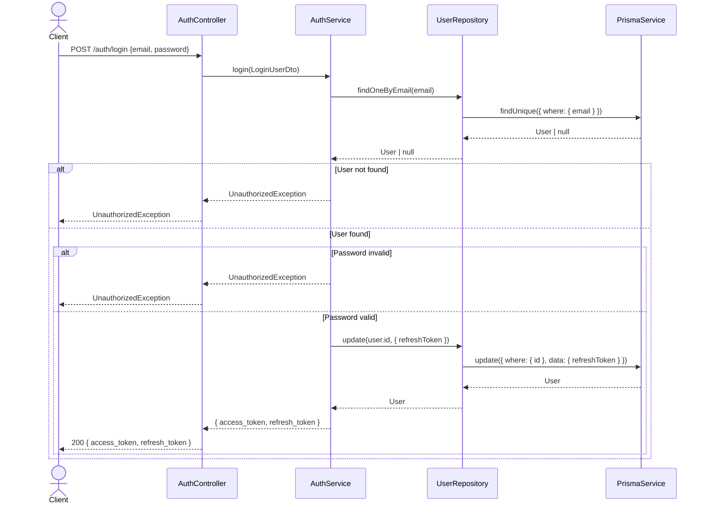

```mermaid
sequenceDiagram
    actor Client
    participant AuthController
    participant AuthService
    participant UserRepository
    participant PrismaService


    %% Login Flow
    Client->>AuthController: POST /auth/login {email, password}
    AuthController->>AuthService: login(LoginUserDto)
    AuthService->>UserRepository: findOneByEmail(email)
    UserRepository->>PrismaService: findUnique({ where: { email } })
    PrismaService-->>UserRepository: User | null
    UserRepository-->>AuthService: User | null
    alt User not found
        AuthService-->>AuthController: UnauthorizedException
        AuthController-->>Client: UnauthorizedException
    else User found
        alt Password invalid
            AuthService-->>AuthController: UnauthorizedException
            AuthController-->>Client: UnauthorizedException
        else Password valid
            AuthService->>UserRepository: update(user.id, { refreshToken })
            UserRepository->>PrismaService: update({ where: { id }, data: { refreshToken } })
            PrismaService-->>UserRepository: User
            UserRepository-->>AuthService: User
            AuthService-->>AuthController: { access_token, refresh_token }
            AuthController-->>Client: 200 { access_token, refresh_token }
        end
    end

```