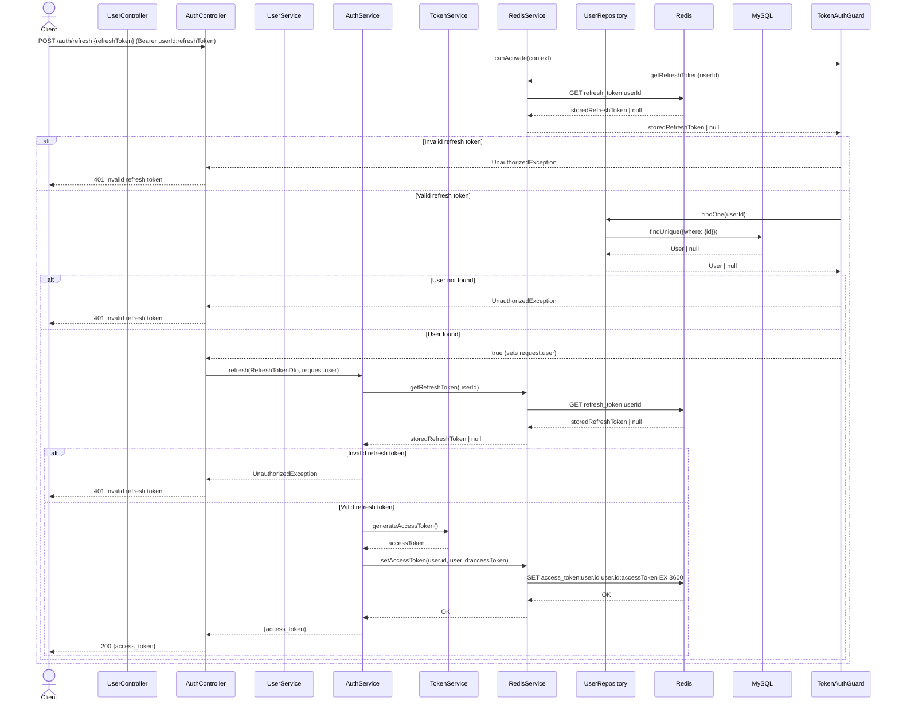

```mermaid
sequenceDiagram
  actor Client
  participant Controller as UserController
  participant AuthController
  participant UserService
  participant AuthService
  participant TokenService
  participant RedisService
  participant UserRepo as UserRepository
  participant Redis
  participant MySQL
  participant Guard as TokenAuthGuard

%% Refresh Flow with Validation
  Client->>AuthController: POST /auth/refresh {refreshToken} (Bearer userId:refreshToken)
  AuthController->>Guard: canActivate(context)
  Guard->>RedisService: getRefreshToken(userId)
  RedisService->>Redis: GET refresh_token:userId
  Redis-->>RedisService: storedRefreshToken | null
  RedisService-->>Guard: storedRefreshToken | null
  alt Invalid refresh token
    Guard-->>AuthController: UnauthorizedException
    AuthController-->>Client: 401 Invalid refresh token
  else Valid refresh token
    Guard->>UserRepo: findOne(userId)
    UserRepo->>MySQL: findUnique({where: {id}})
    MySQL-->>UserRepo: User | null
    UserRepo-->>Guard: User | null
    alt User not found
      Guard-->>AuthController: UnauthorizedException
      AuthController-->>Client: 401 Invalid refresh token
    else User found
      Guard-->>AuthController: true (sets request.user)
      AuthController->>AuthService: refresh(RefreshTokenDto, request.user)
      AuthService->>RedisService: getRefreshToken(userId)
      RedisService->>Redis: GET refresh_token:userId
      Redis-->>RedisService: storedRefreshToken | null
      RedisService-->>AuthService: storedRefreshToken | null
      alt Invalid refresh token
        AuthService-->>AuthController: UnauthorizedException
        AuthController-->>Client: 401 Invalid refresh token
      else Valid refresh token
        AuthService->>TokenService: generateAccessToken()
        TokenService-->>AuthService: accessToken
        AuthService->>RedisService: setAccessToken(user.id, user.id:accessToken)
        RedisService->>Redis: SET access_token:user.id user.id:accessToken EX 3600
        Redis-->>RedisService: OK
        RedisService-->>AuthService: OK
        AuthService-->>AuthController: {access_token}
        AuthController-->>Client: 200 {access_token}
      end
    end
  end
```