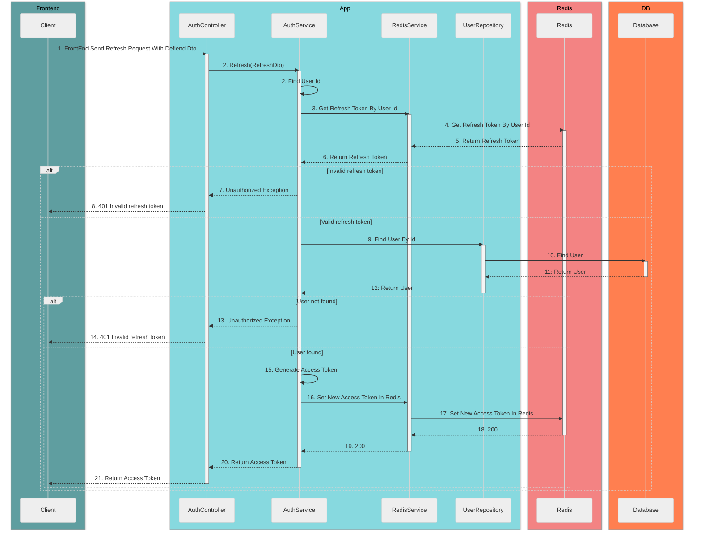

```mermaid
---
config:
  theme: 'neutral'
  themeVariables:
    primaryColor: '#4f96e7ff'
    primaryBorderColor: 'rgba(153, 188, 241, 1)'
    lineColor: '#F8B229'
    secondaryColor: '#006100'
    tertiaryColor: '#ffffff60'
---
sequenceDiagram
box cadetblue Frontend
    participant Client
  end

  box rgba(135, 217, 223, 1) App
    participant AuthController
    participant AuthService
    participant RedisService
    participant UserRepo as UserRepository
  end

  box rgba(243, 131, 131, 1) Redis
    participant Redis
  end

  box coral DB
    participant DB as Database
  end

%% Refresh Flow with Validation
  Client->>AuthController: 1. FrontEnd Send Refresh Request With Defiend Dto
  activate AuthController
  AuthController->> AuthService: 2. Refresh(RefreshDto)
  activate AuthService
  AuthService->> AuthService: 2. Find User Id
  AuthService->>RedisService: 3. Get Refresh Token By User Id
  activate RedisService
  RedisService->>Redis: 4. Get Refresh Token By User Id
  activate Redis
  Redis-->>RedisService: 5. Return Refresh Token
  RedisService-->>AuthService: 6. Return Refresh Token
  alt Invalid refresh token
    AuthService-->>AuthController: 7. Unauthorized Exception
    AuthController-->>Client: 8. 401 Invalid refresh token
  else Valid refresh token
    AuthService->>UserRepo: 9. Find User By Id
    activate UserRepo
    UserRepo->>DB: 10. Find User
    activate DB
    DB-->>UserRepo: 11: Return User
    deactivate DB
    UserRepo-->>AuthService: 12: Return User
    deactivate UserRepo
    alt User not found
      AuthService-->>AuthController: 13. Unauthorized Exception
      AuthController-->>Client: 14. 401 Invalid refresh token
    else User found
      AuthService->>AuthService: 15. Generate Access Token
      AuthService->>RedisService: 16. Set New Access Token In Redis
      RedisService->>Redis: 17. Set New Access Token In Redis
      Redis-->>RedisService: 18. 200
      deactivate Redis
      RedisService-->>AuthService: 19. 200
      deactivate RedisService
      AuthService-->>AuthController: 20. Return Access Token
      deactivate AuthService
      AuthController-->>Client: 21. Return Access Token
      deactivate AuthController
    end
  end
```
