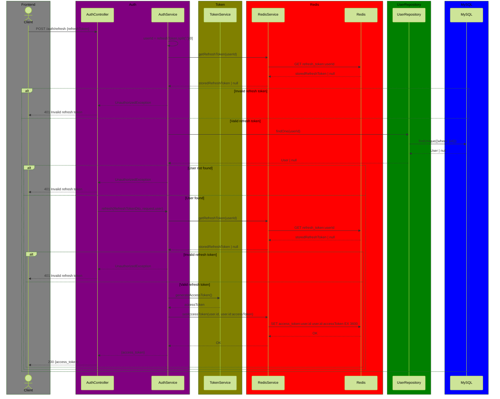

```mermaid
---
config:
  theme: 'forest'
  themeVariables:
    primaryColor: '#BB2528'
    primaryTextColor: '#fff'
    primaryBorderColor: '#fff'
    lineColor: '#F8B229'
    secondaryColor: '#006100'
    tertiaryColor: '#fff'
---
sequenceDiagram
  box Gray Frontend
  actor Client
  end

  box Purple Auth
  participant AuthController
  participant AuthService
  end

  box Olive Token
  participant TokenService
  end

  box Red Redis
  participant RedisService
  participant Redis
  end

  box Green UserRepository
  participant UserRepo as UserRepository
  end

  box Blue MySQL
  participant MySQL
  end

%% Refresh Flow with Validation
  Client->>AuthController: POST /auth/refresh {refreshToken}
  AuthService->> AuthService: userId = refreshToken.split(':')[0]
  AuthService->>RedisService: getRefreshToken(userId)
  RedisService->>Redis: GET refresh_token:userId
  Redis-->>RedisService: storedRefreshToken | null
  RedisService-->>AuthService: storedRefreshToken | null
  alt Invalid refresh token
    AuthService-->>AuthController: UnauthorizedException
    AuthController-->>Client: 401 Invalid refresh token
  else Valid refresh token
    AuthService->>UserRepo: findOne(userId)
    UserRepo->>MySQL: findUnique({where: {id}})
    MySQL-->>UserRepo: User | null
    UserRepo-->>AuthService: User | null
    alt User not found
      AuthService-->>AuthController: UnauthorizedException
      AuthController-->>Client: 401 Invalid refresh token
    else User found
      AuthController->>AuthService: refresh(RefreshTokenDto, request.user)
      AuthService->>RedisService: getRefreshToken(userId)
      RedisService->>Redis: GET refresh_token:userId
      Redis-->>RedisService: storedRefreshToken | null
      RedisService-->>AuthService: storedRefreshToken | null
      alt Invalid refresh token
        AuthService-->>AuthController: UnauthorizedException
        AuthController-->>Client: 401 Invalid refresh token
      else Valid refresh token
        AuthService->>TokenService: generateAccessToken()
        TokenService-->>AuthService: accessToken
        AuthService->>RedisService: setAccessToken(user.id, user.id:accessToken)
        RedisService->>Redis: SET access_token:user.id user.id:accessToken EX 3600
        Redis-->>RedisService: OK
        RedisService-->>AuthService: OK
        AuthService-->>AuthController: {access_token}
        AuthController-->>Client: 200 {access_token}
      end
    end
  end
```
