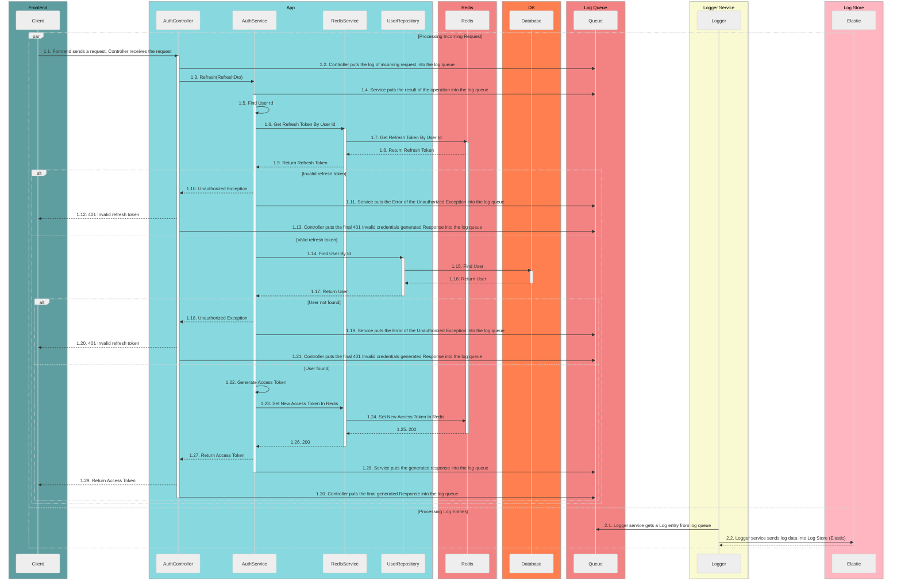

```mermaid
---
config:
  theme: 'neutral'
  themeVariables:
    primaryColor: '#4f96e7ff'
    primaryBorderColor: 'rgba(153, 188, 241, 1)'
    lineColor: '#F8B229'
    secondaryColor: '#006100'
    tertiaryColor: '#ffffff60'
---
sequenceDiagram
box cadetblue Frontend
    participant Client
  end

  box rgba(135, 217, 223, 1) App
    participant AuthController
    participant AuthService
    participant RedisService
    participant UserRepo as UserRepository
  end

  box rgba(243, 131, 131, 1) Redis
    participant Redis
  end

  box coral DB
    participant DB as Database
  end

    box rgba(243,131,131,1) Log Queue
    participant Queue
  end

  box LightGoldenRodYellow Logger Service
    participant Logger
  end

  box LightPink Log Store
    participant Elastic
  end

par Processing Incoming Request
%% Refresh Flow with Validation
  Client->>AuthController: 1.1. Forntend sends a request, Controller receives the request
  activate AuthController
  AuthController ->> Queue: 1.2. Controller puts the log of incoming request into the log queue
  AuthController->> AuthService: 1.3. Refresh(RefreshDto)
  AuthService ->> Queue: 1.4. Service puts the result of the operation into the log queue
  activate AuthService
  AuthService->> AuthService: 1.5. Find User Id
  AuthService->>RedisService: 1.6. Get Refresh Token By User Id
  activate RedisService
  RedisService->>Redis: 1.7. Get Refresh Token By User Id
  activate Redis
  Redis-->>RedisService: 1.8. Return Refresh Token
  RedisService-->>AuthService: 1.9. Return Refresh Token
  alt Invalid refresh token
    AuthService-->>AuthController: 1.10. Unauthorized Exception
    AuthService ->> Queue: 1.11. Service puts the Error of the Unauthorized Exception into the log queue
    AuthController-->>Client: 1.12. 401 Invalid refresh token
    AuthController ->> Queue: 1.13. Controller puts the final 401 Invalid credentials generated Response into the log queue
  else Valid refresh token
    AuthService->>UserRepo: 1.14. Find User By Id
    activate UserRepo
    UserRepo->>DB: 1.15. Find User
    activate DB
    DB-->>UserRepo: 1.16: Return User
    deactivate DB
    UserRepo-->>AuthService: 1.17: Return User
    deactivate UserRepo
    alt User not found
      AuthService-->>AuthController: 1.18. Unauthorized Exception
      AuthService ->> Queue: 1.19. Service puts the Error of the Unauthorized Exception into the log queue
      AuthController-->>Client: 1.20. 401 Invalid refresh token
      AuthController ->> Queue: 1.21. Controller puts the final 401 Invalid credentials generated Response into the log queue
    else User found
      AuthService->>AuthService: 1.22. Generate Access Token
      AuthService->>RedisService: 1.23. Set New Access Token In Redis
      RedisService->>Redis: 1.24. Set New Access Token In Redis
      Redis-->>RedisService: 1.25. 200
      deactivate Redis
      RedisService-->>AuthService: 1.26. 200
      deactivate RedisService
      AuthService-->>AuthController: 1.27. Return Access Token
      AuthService ->> Queue: 1.28. Service puts the generated response into the log queue
      deactivate AuthService
      AuthController-->>Client: 1.29. Return Access Token
      AuthController ->> Queue: 1.30. Controller puts the final generated Response into the log queue
      deactivate AuthController
    end
  end
  and Processing Log Entries
        Logger->>Queue: 2.1. Logger service gets a Log entry from log queue
        Logger ->> Elastic: 2.2. Logger service sends log data into Log Store (Elastic)
        Elastic -->> Logger:
end
```
