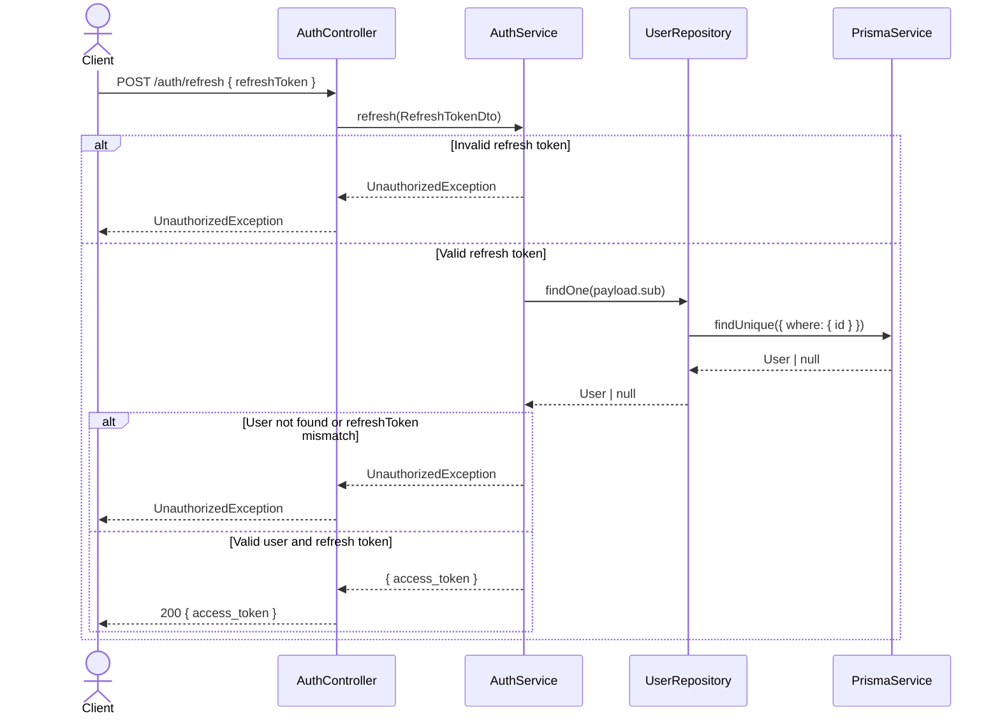

```mermaid
sequenceDiagram
    actor Client
    participant AuthController
    participant AuthService
    participant UserRepository
    participant PrismaService

    %% Refresh Token Flow
    Client->>AuthController: POST /auth/refresh { refreshToken }
    AuthController->>AuthService: refresh(RefreshTokenDto)
    alt Invalid refresh token
        AuthService-->>AuthController: UnauthorizedException
        AuthController-->>Client: UnauthorizedException
    else Valid refresh token
        AuthService->>UserRepository: findOne(payload.sub)
        UserRepository->>PrismaService: findUnique({ where: { id } })
        PrismaService-->>UserRepository: User | null
        UserRepository-->>AuthService: User | null
        alt User not found or refreshToken mismatch
            AuthService-->>AuthController: UnauthorizedException
            AuthController-->>Client: UnauthorizedException
        else Valid user and refresh token
            AuthService-->>AuthController: { access_token }
            AuthController-->>Client: 200 { access_token }
        end
    end
```