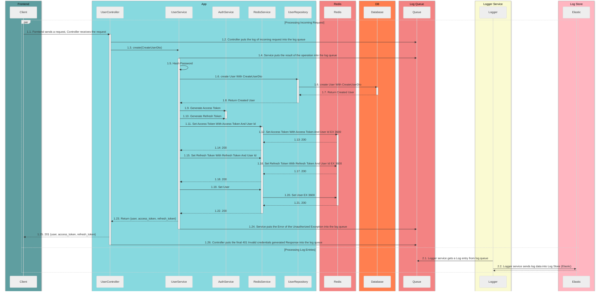

```mermaid
---
config:
  theme: 'neutral'
  themeVariables:
    primaryColor: '#4f96e7ff'
    primaryBorderColor: 'rgba(153, 188, 241, 1)'
    lineColor: '#F8B229'
    secondaryColor: '#006100'
    tertiaryColor: '#ffffff60'
---
sequenceDiagram
box cadetblue Frontend
    participant Client
  end

  box rgba(135, 217, 223, 1) App
    participant UserController
    participant UserService
    participant AuthService
    participant RedisService
    participant UserRepo as UserRepository
  end

  box rgba(243, 131, 131, 1) Redis
    participant Redis
  end

  box coral DB
    participant DB as Database
  end

  box rgba(243,131,131,1) Log Queue
    participant Queue
  end

  box LightGoldenRodYellow Logger Service
    participant Logger
  end

  box LightPink Log Store
    participant Elastic
  end

par Processing Incoming Request
  %% Registration Flow
  Client->>UserController: 1.1. Forntend sends a request, Controller receives the request
  activate UserController
  UserController ->> Queue: 1.2. Controller puts the log of incoming request into the log queue
  UserController->>UserService: 1.3. create(CreateUserDto)
  UserService ->> Queue: 1.4. Service puts the result of the operation into the log queue
  activate UserService
  UserService->> UserService: 1.5. Hash Password
  UserService->>UserRepo: 1.6. create User With CreateUserDto 
  activate UserRepo
  UserRepo->>DB: 1.6. create User With CreateUserDto 
  activate DB
  DB-->>UserRepo: 1.7. Return Created User
  deactivate DB
  UserRepo-->>UserService: 1.8. Return Created User
  deactivate UserRepo
  UserService->>AuthService: 1.9. Generate Access Token
  activate AuthService
  UserService->>AuthService: 1.10. Generate Refresh Token
  deactivate AuthService
  UserService->>RedisService: 1.11. Set Access Token With Access Token And User Id
  activate RedisService
  RedisService->>Redis: 1.12. Set Access Token With Access Token And User Id EX 3600
  activate Redis
  Redis-->>RedisService: 1.13: 200
  RedisService-->>UserService: 1.14: 200
  UserService->>RedisService: 1.15. Set Refresh Token With Refresh Token And User Id
  RedisService->>Redis: 1.16. Set Refresh Token With Refresh Token And User Id EX 3600
  Redis-->>RedisService: 1.17. 200
  RedisService-->>UserService: 1.18. 200
  UserService->>RedisService: 1.19. Set User
  RedisService->>Redis: 1.20. Set User EX 3600
  Redis-->>RedisService: 1.21. 200
  deactivate Redis
  RedisService-->>UserService: 1.22. 200
  deactivate RedisService
  UserService-->>UserController: 1.23. Return {user, access_token, refresh_token}
  UserService ->> Queue: 1.24. Service puts the Error of the Unauthorized Exception into the log queue
  deactivate UserService
  UserController-->>Client: 1.25. 201 {user, access_token, refresh_token}
  UserController ->> Queue: 1.26. Controller puts the final 401 Invalid credentials generated Response into the log queue
  deactivate UserController
  and Processing Log Entries
        Logger->>Queue: 2.1. Logger service gets a Log entry from log queue
        Logger ->> Elastic: 2.2. Logger service sends log data into Log Store (Elastic)
        Elastic -->> Logger:
end
```