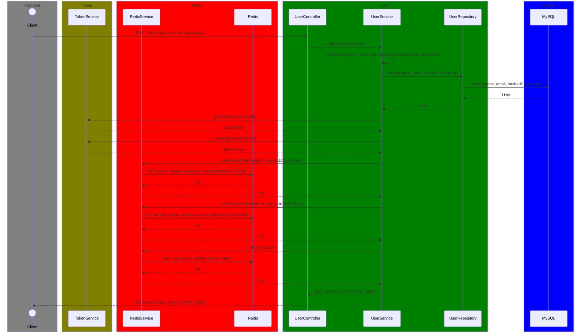

```mermaid
sequenceDiagram
  box Gray Frontend
  actor Client
  end

  box Olive Token
  participant TokenService
  end

  box Red Redis
  participant RedisService
  participant Redis
  end

  box Green User
  participant Controller as UserController
  participant UserService
  participant UserRepo as UserRepository
  end

  box Blue MySQL
  participant MySQL
  end

  %% Registration Flow
  Client->>Controller: POST /users {name, email, password}
  Controller->>UserService: create(CreateUserDto)
  UserService->> UserService: hashedPassword = await argon2.hash(createUserDto.password);
  UserService->>UserRepo: create({name, email, hashedPassword})
  UserRepo->>MySQL: create({name, email, hashedPassword})
  MySQL-->>UserRepo: User
  UserRepo-->>UserService: User
  UserService->>TokenService: generateAccessToken()
  TokenService-->>UserService: accessToken
  UserService->>TokenService: generateRefreshToken()
  TokenService-->>UserService: refreshToken
  UserService->>RedisService: setAccessToken(user.id, user.id:accessToken)
  RedisService->>Redis: SET access_token:user.id user.id:accessToken EX 3600
  Redis-->>RedisService: OK
  RedisService-->>UserService: OK
  UserService->>RedisService: setRefreshToken(user.id, user.id:refreshToken)
  RedisService->>Redis: SET refresh_token:user.id user.id:refreshToken EX 604800
  Redis-->>RedisService: OK
  RedisService-->>UserService: OK
  UserService->>RedisService: setUser(user)
  RedisService->>Redis: SET user:user.id JSON(user) EX 3600
  Redis-->>RedisService: OK
  RedisService-->>UserService: OK
  UserService-->>Controller: {user, access_token, refresh_token}
  Controller-->>Client: 201 {user, access_token, refresh_token}
```