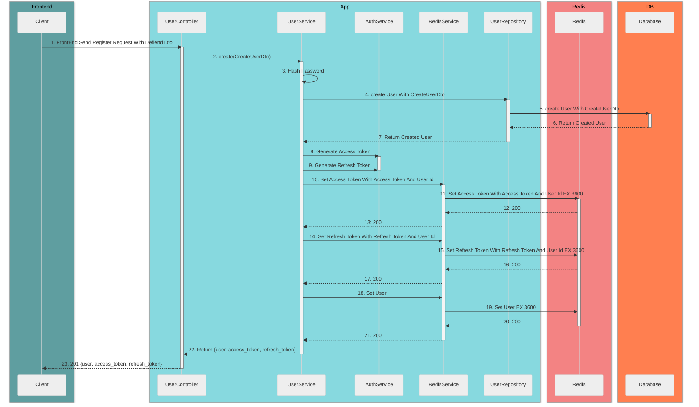

```mermaid
---
config:
  theme: 'neutral'
  themeVariables:
    primaryColor: '#4f96e7ff'
    primaryBorderColor: 'rgba(153, 188, 241, 1)'
    lineColor: '#F8B229'
    secondaryColor: '#006100'
    tertiaryColor: '#ffffff60'
---
sequenceDiagram
box cadetblue Frontend
    participant Client
  end

  box rgba(135, 217, 223, 1) App
    participant UserController
    participant UserService
    participant AuthService
    participant RedisService
    participant UserRepo as UserRepository
  end

  box rgba(243, 131, 131, 1) Redis
    participant Redis
  end

  box coral DB
    participant DB as Database
  end

  %% Registration Flow
  Client->>UserController: 1. FrontEnd Send Register Request With Defiend Dto
  activate UserController
  UserController->>UserService: 2. create(CreateUserDto)
  activate UserService
  UserService->> UserService: 3. Hash Password
  UserService->>UserRepo: 4. create User With CreateUserDto 
  activate UserRepo
  UserRepo->>DB: 5. create User With CreateUserDto 
  activate DB
  DB-->>UserRepo: 6. Return Created User
  deactivate DB
  UserRepo-->>UserService: 7. Return Created User
  deactivate UserRepo
  UserService->>AuthService: 8. Generate Access Token
  activate AuthService
  UserService->>AuthService: 9. Generate Refresh Token
  deactivate AuthService
  UserService->>RedisService: 10. Set Access Token With Access Token And User Id
  activate RedisService
  RedisService->>Redis: 11. Set Access Token With Access Token And User Id EX 3600
  activate Redis
  Redis-->>RedisService: 12: 200
  RedisService-->>UserService: 13: 200
  UserService->>RedisService: 14. Set Refresh Token With Refresh Token And User Id
  RedisService->>Redis: 15. Set Refresh Token With Refresh Token And User Id EX 3600
  Redis-->>RedisService: 16. 200
  RedisService-->>UserService: 17. 200
  UserService->>RedisService: 18. Set User
  RedisService->>Redis: 19. Set User EX 3600
  Redis-->>RedisService: 20. 200
  deactivate Redis
  RedisService-->>UserService: 21. 200
  deactivate RedisService
  UserService-->>UserController: 22. Return {user, access_token, refresh_token}
  deactivate UserService
  UserController-->>Client: 23. 201 {user, access_token, refresh_token}
  deactivate UserController
```