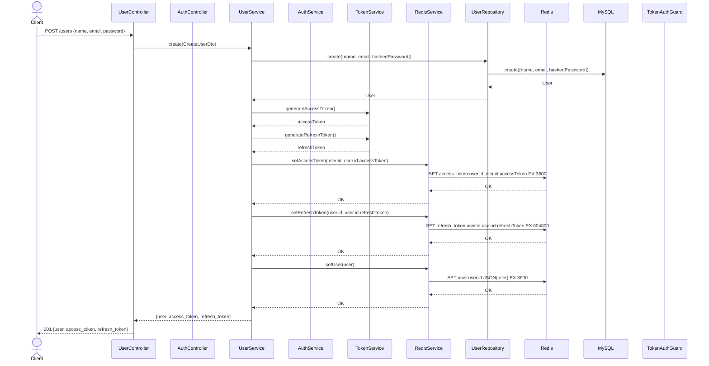

```mermaid
sequenceDiagram
  actor Client
  participant Controller as UserController
  participant AuthController
  participant UserService
  participant AuthService
  participant TokenService
  participant RedisService
  participant UserRepo as UserRepository
  participant Redis
  participant MySQL
  participant Guard as TokenAuthGuard

  %% Registration Flow
  Client->>Controller: POST /users {name, email, password}
  Controller->>UserService: create(CreateUserDto)
  UserService->>UserRepo: create({name, email, hashedPassword})
  UserRepo->>MySQL: create({name, email, hashedPassword})
  MySQL-->>UserRepo: User
  UserRepo-->>UserService: User
  UserService->>TokenService: generateAccessToken()
  TokenService-->>UserService: accessToken
  UserService->>TokenService: generateRefreshToken()
  TokenService-->>UserService: refreshToken
  UserService->>RedisService: setAccessToken(user.id, user.id:accessToken)
  RedisService->>Redis: SET access_token:user.id user.id:accessToken EX 3600
  Redis-->>RedisService: OK
  RedisService-->>UserService: OK
  UserService->>RedisService: setRefreshToken(user.id, user.id:refreshToken)
  RedisService->>Redis: SET refresh_token:user.id user.id:refreshToken EX 604800
  Redis-->>RedisService: OK
  RedisService-->>UserService: OK
  UserService->>RedisService: setUser(user)
  RedisService->>Redis: SET user:user.id JSON(user) EX 3600
  Redis-->>RedisService: OK
  RedisService-->>UserService: OK
  UserService-->>Controller: {user, access_token, refresh_token}
  Controller-->>Client: 201 {user, access_token, refresh_token}
```