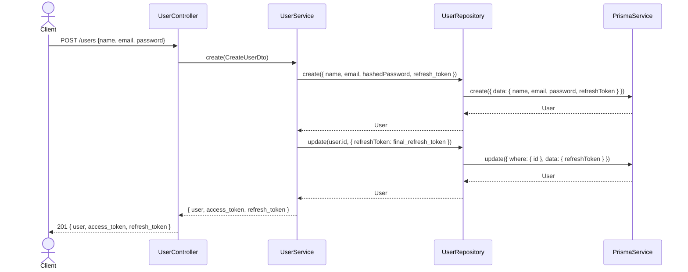

```mermaid
sequenceDiagram
    actor Client
    participant UserController
    participant UserService
    participant UserRepository
    participant PrismaService

    %% Registration Flow
    Client->>UserController: POST /users {name, email, password}
    UserController->>UserService: create(CreateUserDto)
    UserService->>UserRepository: create({ name, email, hashedPassword, refresh_token })
    UserRepository->>PrismaService: create({ data: { name, email, password, refreshToken } })
    PrismaService-->>UserRepository: User
    UserRepository-->>UserService: User
    UserService->>UserRepository: update(user.id, { refreshToken: final_refresh_token })
    UserRepository->>PrismaService: update({ where: { id }, data: { refreshToken } })
    PrismaService-->>UserRepository: User
    UserRepository-->>UserService: User
    UserService-->>UserController: { user, access_token, refresh_token }
    UserController-->>Client: 201 { user, access_token, refresh_token }
```