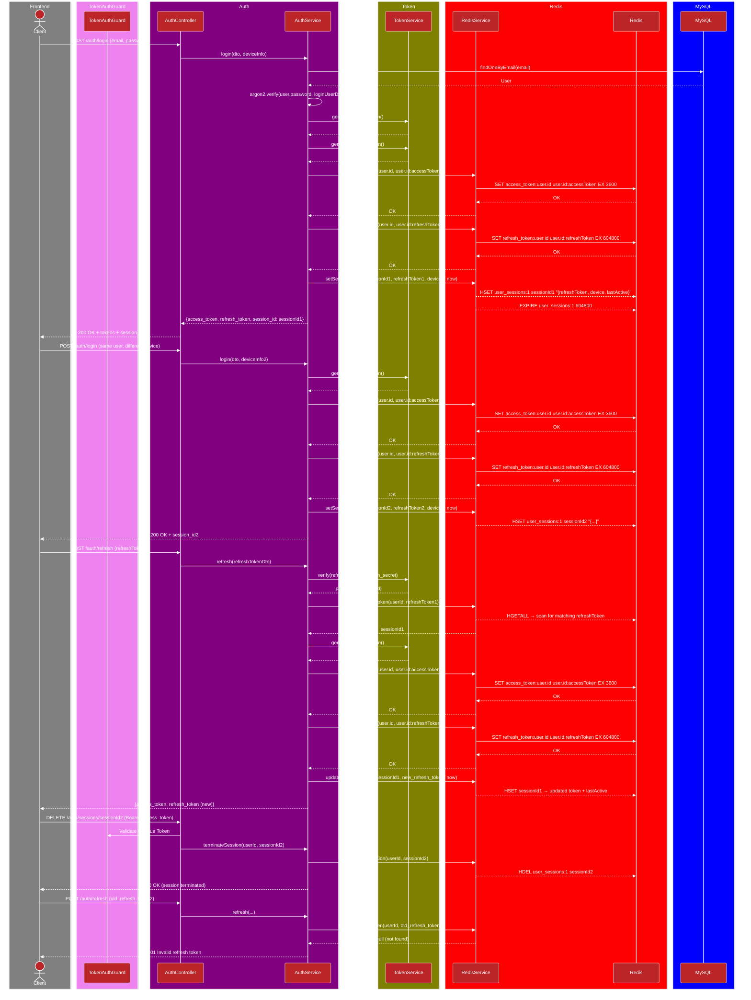

```mermaid
---
config:
  theme: 'base'
  themeVariables:
    primaryColor: '#BB2528'
    primaryTextColor: '#fff'
    primaryBorderColor: '#fff'
    lineColor: '#F8B229'
    secondaryColor: '#006100'
    tertiaryColor: '#fff'
---
sequenceDiagram
    box Gray Frontend
    actor Client
    end

    box Violet TokenAuthGuard
    participant TokenAuthGuard
    end

    box Purple Auth
    participant AuthController
    participant AuthService
    end

    box Olive Token
    participant TokenService
    end

    box Red Redis
    participant RedisService
    participant Redis
    end

    box Blue MySQL
    participant MySQL
    end

    %% === Login from Device 1 ===
    Client->>AuthController: POST /auth/login {email, password}
    AuthController->>AuthService: login(dto, deviceInfo)
    AuthService->>MySQL: findOneByEmail(email)
    MySQL-->>AuthService: User
    AuthService ->> AuthService: argon2.verify(user.password, loginUserDto.password)
    AuthService->>TokenService: generateAccessToken()
    TokenService-->>AuthService: accessToken
    AuthService->>TokenService: generateRefreshToken()
    TokenService-->>AuthService: refreshToken
    AuthService->>RedisService: setAccessToken(user.id, user.id:accessToken)
    RedisService->>Redis: SET access_token:user.id user.id:accessToken EX 3600
    Redis-->>RedisService: OK
    RedisService-->>AuthService: OK
    AuthService->>RedisService: setRefreshToken(user.id, user.id:refreshToken)
    RedisService->>Redis: SET refresh_token:user.id user.id:refreshToken EX 604800
    Redis-->>RedisService: OK
    RedisService-->>AuthService: OK
    AuthService->>RedisService: setSession(userId, sessionId1, refreshToken1, device1, now)
    RedisService-->>Redis: HSET user_sessions:1 sessionId1 "{refreshToken, device, lastActive}"
    RedisService-->>Redis: EXPIRE user_sessions:1 604800
    AuthService-->>AuthController: {access_token, refresh_token, session_id: sessionId1}
    AuthController-->>Client: 200 OK + tokens + session_id

    %% === Login from Device 2 ===
    Client->>AuthController: POST /auth/login (same user, different device)
    AuthController->>AuthService: login(dto, deviceInfo2)
    AuthService->>TokenService: generateRefreshToken()
    TokenService-->>AuthService: refreshToken
    AuthService->>RedisService: setAccessToken(user.id, user.id:accessToken)
    RedisService->>Redis: SET access_token:user.id user.id:accessToken EX 3600
    Redis-->>RedisService: OK
    RedisService-->>AuthService: OK
    AuthService->>RedisService: setRefreshToken(user.id, user.id:refreshToken)
    RedisService->>Redis: SET refresh_token:user.id user.id:refreshToken EX 604800
    Redis-->>RedisService: OK
    RedisService-->>AuthService: OK
    AuthService->>RedisService: setSession(userId, sessionId2, refreshToken2, device2, now)
    RedisService-->>Redis: HSET user_sessions:1 sessionId2 "{...}"
    AuthService-->>Client: 200 OK + session_id2

    %% === Refresh Session (Device 1) ===
    Client->>AuthController: POST /auth/refresh {refreshToken1}
    AuthController->>AuthService: refresh(refreshTokenDto)
    AuthService->>TokenService: verify(refreshToken1, refresh_secret)
    TokenService-->>AuthService: payload {sub: userId}
    AuthService->>RedisService: findSessionByToken(userId, refreshToken1)
    RedisService-->>Redis: HGETALL → scan for matching refreshToken
    RedisService-->>AuthService: sessionId1
    AuthService->>TokenService: generateRefreshToken()
    TokenService-->>AuthService: refreshToken
    AuthService->>RedisService: setAccessToken(user.id, user.id:accessToken)
    RedisService->>Redis: SET access_token:user.id user.id:accessToken EX 3600
    Redis-->>RedisService: OK
    RedisService-->>AuthService: OK
    AuthService->>RedisService: setRefreshToken(user.id, user.id:refreshToken)
    RedisService->>Redis: SET refresh_token:user.id user.id:refreshToken EX 604800
    Redis-->>RedisService: OK
    RedisService-->>AuthService: OK
    AuthService->>RedisService: updateSession(userId, sessionId1, new_refresh_token, now)
    RedisService-->>Redis: HSET sessionId1 → updated token + lastActive
    AuthService-->>Client: {access_token, refresh_token (new)}

    %% === Terminate Session (Device 2) ===
    Client->>AuthController: DELETE /auth/sessions/sessionId2 (Bearer access_token)
    AuthController->>TokenAuthGuard: Validate Opaque Token
    AuthController->>AuthService: terminateSession(userId, sessionId2)
    AuthService->>RedisService: deleteSession(userId, sessionId2)
    RedisService-->>Redis: HDEL user_sessions:1 sessionId2
    AuthService-->>Client: 200 OK (session terminated)

    %% === Failed Refresh (Terminated Token) ===
    Client->>AuthController: POST /auth/refresh {old_refresh_token2}
    AuthController->>AuthService: refresh(...)
    AuthService->>RedisService: findSessionByToken(userId, old_refresh_token2)
    RedisService-->>AuthService: null (not found)
    AuthService-->>Client: 401 Invalid refresh token
```