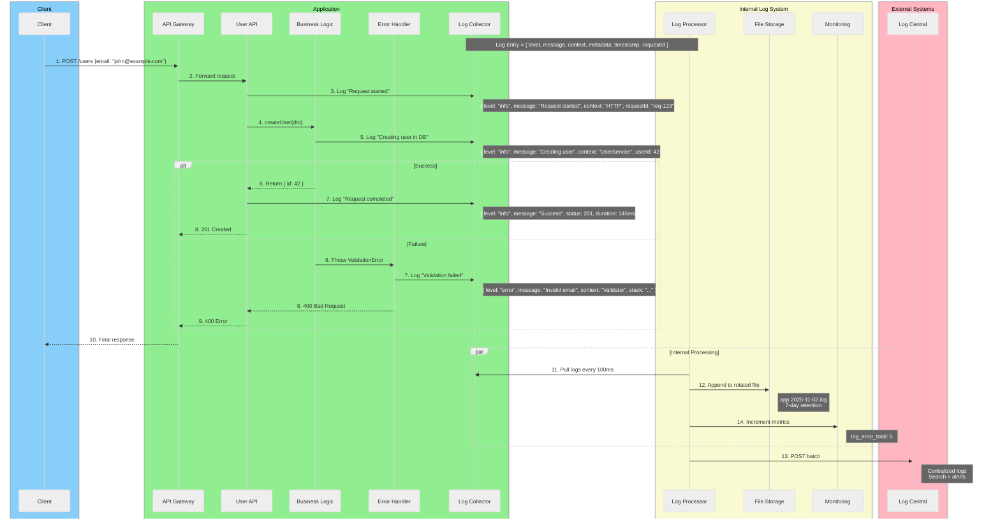

```mermaid
---
config:
  theme: 'neutral'
  themeVariables:
    primaryColor: '#4f96e7ff'
    primaryBorderColor: 'rgba(153, 188, 241, 1)'
    lineColor: '#F8B229'
    secondaryColor: '#006100'
    tertiaryColor: '#ffffff60'
---
sequenceDiagram
    %% === GROUP 1: CLIENT (Light Blue) ===
    box LightSkyBlue Client
        participant Client
    end

    %% === GROUP 2: APP (Light Green) ===
    box LightGreen Application
        participant API Gateway
        participant User API
        participant Business Logic
        participant Error Handler
        participant Log Collector
    end

    %% === GROUP 3: LOG SYSTEM (Light Yellow) ===
    box LightGoldenRodYellow Internal Log System
        participant Log Processor
        participant File Storage
        participant Monitoring
    end

    %% === GROUP 4: EXTERNAL (Light Pink) ===
    box LightPink External Systems
        participant Log Central
    end

    Note over Log Collector,Log Processor: Log Entry = { level, message, context, metadata, timestamp, requestId }

    %% === CLIENT → APP ===
    Client->>API Gateway: 1. POST /users {email: "john@example.com"}
    API Gateway->>User API: 2. Forward request

    %% === APP: Request & Business Flow ===
    User API->>Log Collector: 3. Log "Request started"
    Note right of Log Collector: { level: "info", message: "Request started", context: "HTTP", requestId: "req-123" }

    User API->>Business Logic: 4. createUser(dto)
    Business Logic->>Log Collector: 5. Log "Creating user in DB"
    Note right of Log Collector: { level: "info", message: "Creating user", context: "UserService", userId: 42 }

    alt Success
        Business Logic-->>User API: 6. Return { id: 42 }
        User API->>Log Collector: 7. Log "Request completed"
        Note right of Log Collector: { level: "info", message: "Success", status: 201, duration: 145ms }
        User API-->>API Gateway: 8. 201 Created
    else Failure
        Business Logic->>Error Handler: 6. Throw ValidationError
        Error Handler->>Log Collector: 7. Log "Validation failed"
        Note right of Log Collector: { level: "error", message: "Invalid email", context: "Validator", stack: "..." }
        Error Handler-->>User API: 8. 400 Bad Request
        User API-->>API Gateway: 9. 400 Error
    end

    %% === APP → CLIENT ===
    API Gateway-->>Client: 10. Final response

    %% === LOG SYSTEM: Internal Processing ===
    par Internal Processing
        Log Processor->>Log Collector: 11. Pull logs every 100ms
        Log Processor->>File Storage: 12. Append to rotated file
        Note right of File Storage: app.2025-11-02.log<br/>7-day retention
        Log Processor->>Monitoring: 14. Increment metrics
        Note right of Monitoring: log_error_total: 5
    end

    %% === LOG SYSTEM → EXTERNAL ===
    Log Processor->>Log Central: 13. POST batch
    Note right of Log Central: Centralized logs<br/>Search + alerts
```

