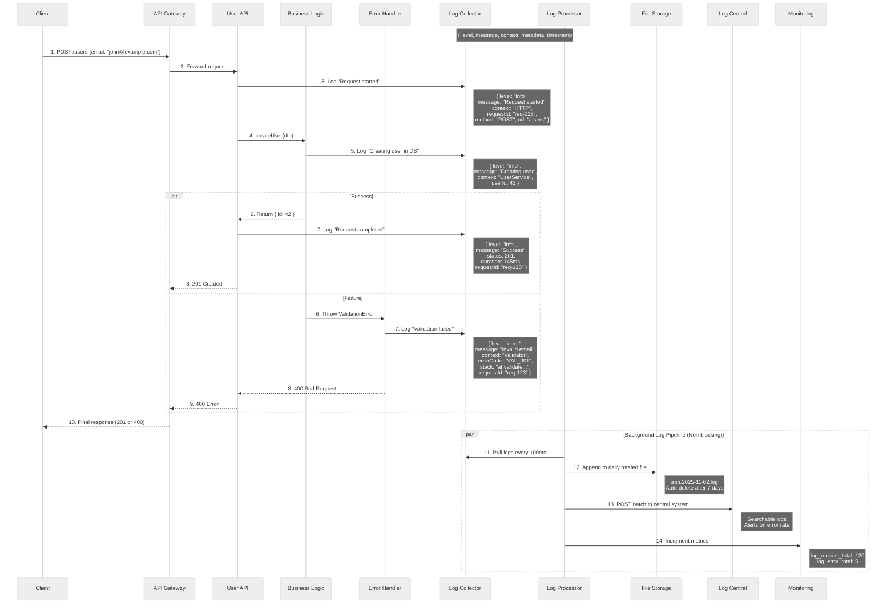

```mermaid
---
config:
  theme: 'neutral'
  themeVariables:
    primaryColor: '#4f96e7ff'
    primaryBorderColor: 'rgba(153, 188, 241, 1)'
    lineColor: '#F8B229'
    secondaryColor: '#006100'
    tertiaryColor: '#ffffff60'
---
sequenceDiagram
    participant Client
    participant API Gateway
    participant User API
    participant Business Logic
    participant Error Handler
    participant Log Collector
    participant Log Processor
    participant File Storage
    participant Log Central
    participant Monitoring

    Note over Log Collector,Log Processor: Log Entry = { level, message, context, metadata, timestamp, requestId }

    %% === STEP 1: Client sends request ===
    Client->>API Gateway: 1. POST /users {email: "john@example.com"}
    API Gateway->>User API: 2. Forward request

    %% === STEP 2: Log request start ===
    User API->>Log Collector: 3. Log "Request started"
    Note right of Log Collector: { level: "info",<br/>message: "Request started",<br/>context: "HTTP",<br/>requestId: "req-123",<br/>method: "POST", url: "/users" }

    %% === STEP 3: Execute business logic ===
    User API->>Business Logic: 4. createUser(dto)

    %% === STEP 4: Developer logs business event ===
    Business Logic->>Log Collector: 5. Log "Creating user in DB"
    Note right of Log Collector: { level: "info",<br/>message: "Creating user",<br/>context: "UserService",<br/>userId: 42 }

    %% === STEP 5: Success path ===
    alt Success
        Business Logic-->>User API: 6. Return { id: 42 }
        User API->>Log Collector: 7. Log "Request completed"
        Note right of Log Collector: { level: "info",<br/>message: "Success",<br/>status: 201,<br/>duration: 145ms,<br/>requestId: "req-123" }
        User API-->>API Gateway: 8. 201 Created
    else Failure
        %% === STEP 6: Error occurs ===
        Business Logic->>Error Handler: 6. Throw ValidationError
        %% === STEP 7: Auto-log error ===
        Error Handler->>Log Collector: 7. Log "Validation failed"
        Note right of Log Collector: { level: "error",<br/>message: "Invalid email",<br/>context: "Validator",<br/>errorCode: "VAL_001",<br/>stack: "at validate...",<br/>requestId: "req-123" }
        Error Handler-->>User API: 8. 400 Bad Request
        User API-->>API Gateway: 9. 400 Error
    end

    %% === STEP 9 / 10: Return response to client ===
    API Gateway-->>Client: 10. Final response (201 or 400)

    %% === STEP 11: Background processing (parallel) ===
    par Background Log Pipeline (Non-blocking)
        Log Processor->>Log Collector: 11. Pull logs every 100ms
        Log Processor->>File Storage: 12. Append to daily rotated file
        Note right of File Storage: app.2025-11-02.log<br/>Auto-delete after 7 days

        Log Processor->>Log Central: 13. POST batch to central system
        Note right of Log Central: Searchable logs<br/>Alerts on error rate

        Log Processor->>Monitoring: 14. Increment metrics
        Note right of Monitoring: log_request_total: 120<br/>log_error_total: 5
    end
```

