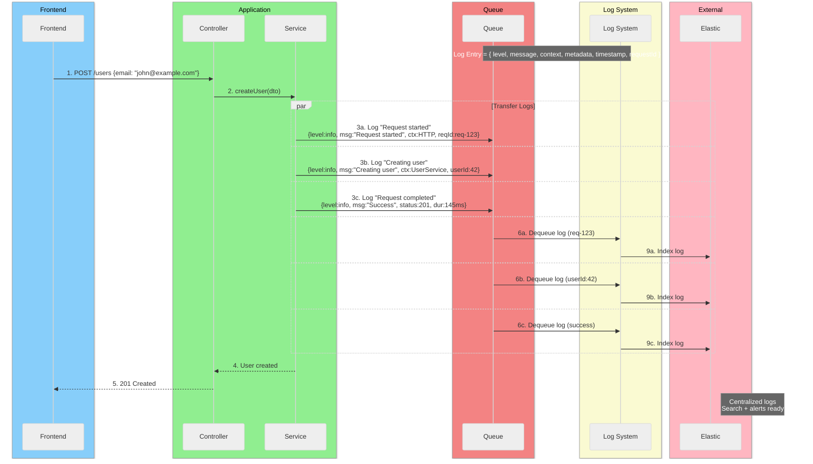

```mermaid
---
config:
  theme: 'neutral'
  themeVariables:
    primaryColor: '#4f96e7ff'
    primaryBorderColor: 'rgba(153, 188, 241, 1)'
    lineColor: '#F8B229'
    secondaryColor: '#006100'
    tertiaryColor: '#ffffff60'
---

sequenceDiagram
    %% === Groups ===
    box LightSkyBlue Frontend
        participant Frontend
    end

    box LightGreen Application
        participant Controller
        participant Service
    end

    box rgba(243,131,131,1) Queue
        participant Queue
    end

    box LightGoldenRodYellow Log System
        participant Log System
        %%participant Store logs in Distk
        %%participant Show All Logs
    end

    box LightPink External
        participant Elastic
    end

    Note over Queue,Log System: Log Entry = { level, message, context, metadata, timestamp, requestId }

    %% === Main Flow ===
    Frontend->>Controller: 1. POST /users {email: "john@example.com"}
    Controller->>Service: 2. createUser(dto)

    %% === PARALLEL: Send logs to queue ===
    par Transfer Logs
        Service->>Queue: 3a. Log "Request started"<br>{level:info, msg:"Request started", ctx:HTTP, reqId:req-123}
    and
        Service->>Queue: 3b. Log "Creating user"<br>{level:info, msg:"Creating user", ctx:UserService, userId:42}
    and
        Service->>Queue: 3c. Log "Request completed"<br>{level:info, msg:"Success", status:201, dur:145ms}
    and
        Queue->>Log System: 6a. Dequeue log (req-123)
        %%Log Processor->>Store logs in Distk: 7a. Append to app.2025-11-03.log
        %%Log Processor->>Show All Logs: 8a. Inc log_info_total
        Log System->>Elastic: 9a. Index log
    and
        Queue->>Log System: 6b. Dequeue log (userId:42)
        %%Log Processor->>Store logs in Distk: 7b. Append
        %%Log Processor->>Show All Logs: 8b. Inc log_info_total
        Log System->>Elastic: 9b. Index log
    and
        Queue->>Log System: 6c. Dequeue log (success)
        %%Log Processor->>Store logs in Distk: 7c. Append
        %%Log Processor->>Show All Logs: 8c. Inc log_success_total
        Log System->>Elastic: 9c. Index log
    end

    Service-->>Controller: 4. User created
    Controller-->>Frontend: 5. 201 Created

    %% === PARALLEL: Dequeue & Process Logs ===


    Note right of Elastic: Centralized logs<br>Search + alerts ready
```

