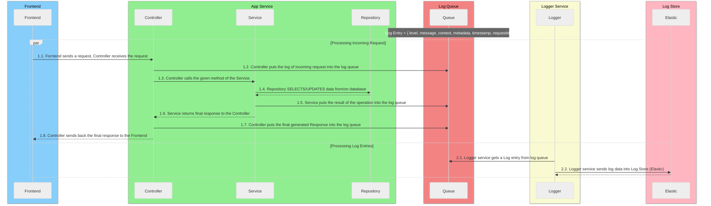

```mermaid
---
config:
  theme: 'neutral'
  themeVariables:
    primaryColor: '#4f96e7ff'
    primaryBorderColor: 'rgba(153, 188, 241, 1)'
    lineColor: '#F8B229'
    secondaryColor: '#006100'
    tertiaryColor: '#ffffff60'
---

sequenceDiagram
    %% === Groups ===
    box LightSkyBlue Frontend
        participant Frontend
    end

    box LightGreen App Service
        participant Controller
        participant Service
        participant Repository
    end

    box rgba(243,131,131,1) Log Queue
        participant Queue
    end

    box LightGoldenRodYellow Logger Service
        participant Logger
    end

    box LightPink Log Store
        participant Elastic
    end

    Note over Queue: Log Entry = { level, message, context, metadata, timestamp, requestId }

    par Processing Incoming Request
        Frontend->>Controller: 1.1. Forntend sends a request, Controller receives the request
        Controller ->> Queue: 1.2. Controller puts the log of incoming request into the log queue

        Controller->>Service: 1.3. Controller calls the given method of the Service
        Service ->> Repository: 1.4. Repository SELECTS/UPDATES data from/on database
        Repository -->> Service:

        Service ->> Queue: 1.5. Service puts the result of the operation into the log queue

        Service -->> Controller: 1.6. Service returns final response to the Controller

        Controller ->> Queue: 1.7. Controller puts the final generated Response into the log queue

        Controller-->>Frontend: 1.8. Controller sends back the final response to the Frontend

    and Processing Log Entries
        Logger->>Queue: 2.1. Logger service gets a Log entry from log queue
        Logger ->> Elastic: 2.2. Logger service sends log data into Log Store (Elastic)
        Elastic -->> Logger:
    end
```

